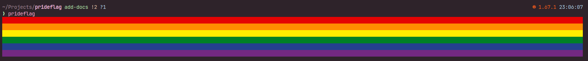

# Prideflag

Prints a pride flag in the console.

Side project for fun.

## Compile

```
cargo build --release
```

## Run

```
./target/release/prideflag
```

By default, it prints the rainbow flag, but you can specify another one:

```
./target/release/prideflag --flag lesbian
```

## Examples

**Without args**



**Arg `lesbian`**


**Arg `g` (alias for `gay`)**


